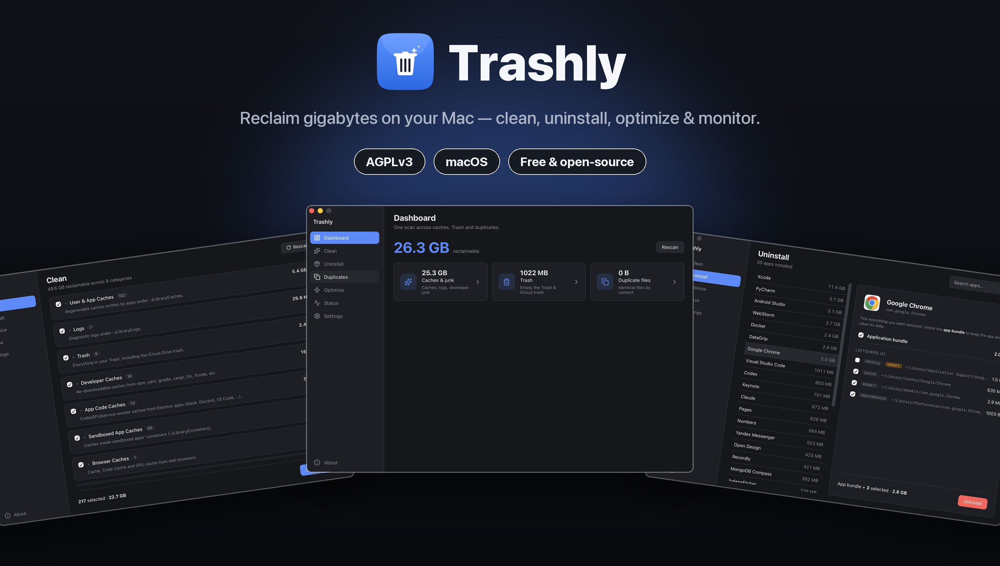
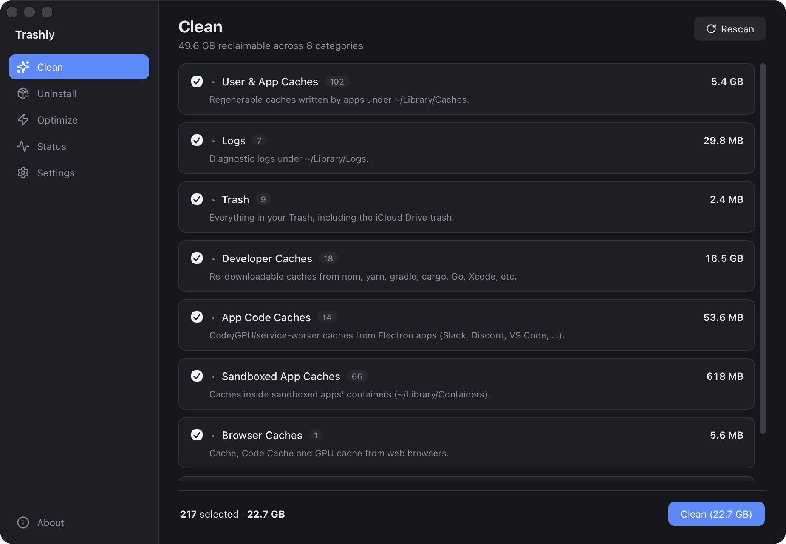
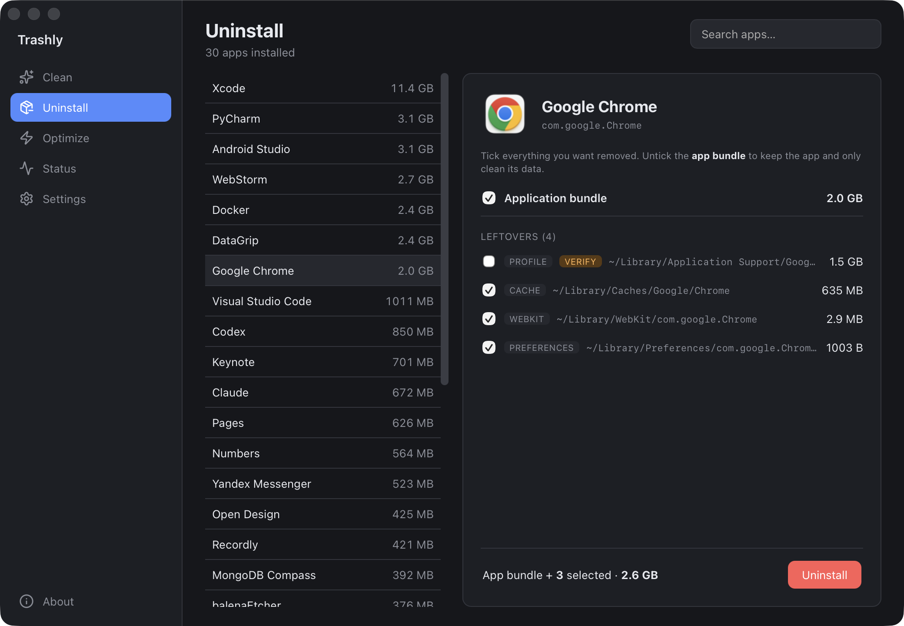
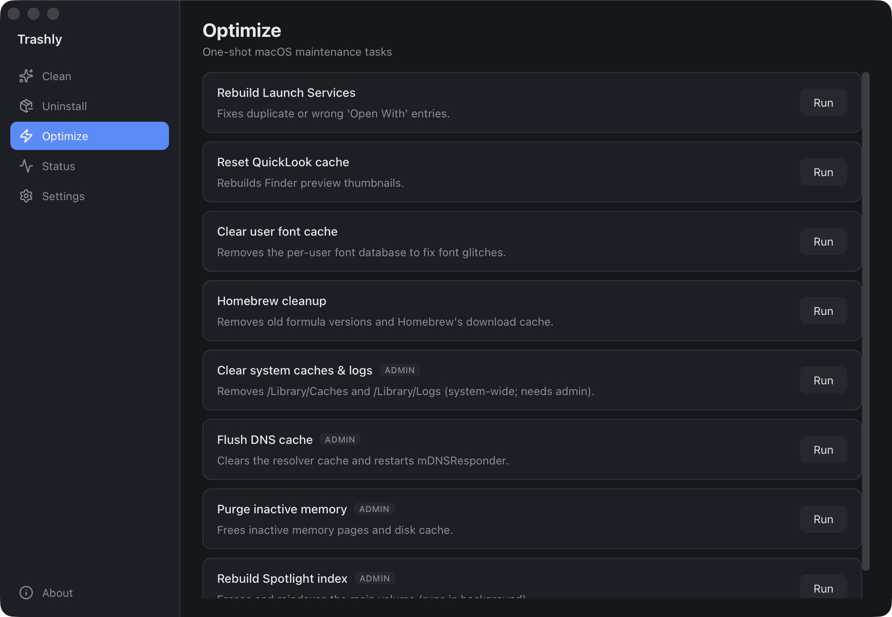
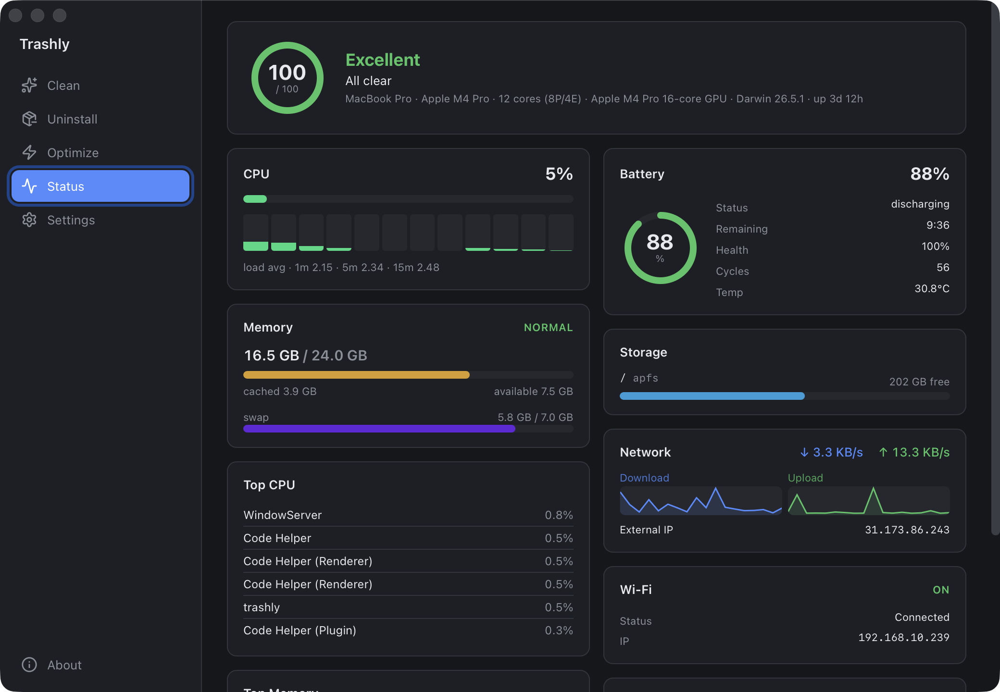

<div align="center">


# Trashly

### Reclaim gigabytes on your Mac — clean, uninstall, optimize and monitor, in one fast native app.

A free & open-source macOS toolkit that finds the junk other cleaners miss, removes apps **with every leftover**, and shows you exactly what's happening on your machine — all behind a slick custom UI.

[](LICENSE)
[](#install)
[](#install)
[](https://tauri.app)
[](https://www.rust-lang.org)
[](https://react.dev)


[**Download**](#install) · [**Features**](#features) · [**Screenshots**](#screenshots) · [**Build**](#build-from-source) · [**Safety**](#-safety-first)



</div>


## Why Trashly?

Most cleaners either nag you for money, ship a giant Electron bundle, or quietly miss the gigabytes that actually matter (Xcode device support, Android emulators, Electron code caches, the iCloud trash…). **Trashly is different:**

- ⚡️ **Tiny & fast** — a Rust core + native WebView. No Electron, no bloat, instant scans.
- 🔎 **Finds what others miss** — generic cache roots *plus* curated heavy-data paths for Xcode, Android Studio, JetBrains, Docker, browsers and more.
- 🧯 **Safe by design** — every deletion is re-validated against an allow-list in Rust; defaults to the **Trash** (recoverable).
- 🆓 **Free & open source** — AGPLv3, no upsells, no telemetry.

## Features

### 🧹 Clean — reclaim disk space
Progressive scanning renders instantly, then streams sizes in so a 3 GB cache never freezes the UI.

- **User & app caches** — everything under `~/Library/Caches`, per-item so you choose what stays.
- **Developer caches** — Xcode DerivedData / iOS DeviceSupport / device logs, npm, yarn, bun, gradle, cargo, Go, CocoaPods…
- **App & container caches** — Electron `Code Cache`/`GPUCache`/service workers, sandboxed-app caches.
- **Browser caches** — Chrome, Edge, Brave, Arc, Vivaldi, Opera, Yandex.
- **Project build artifacts** — finds `node_modules`, `target`, `dist`, `.next`… sitting next to a real project manifest in your dev folders.
- **Logs** & **Trash** — including the separate **iCloud Drive trash** that Finder hides.
- Per-category checkboxes, live totals, and a clear **Move to Trash / Delete permanently** choice.

### 🗑 Uninstall — apps + every leftover
Drag an app to the Bin and you leave gigabytes behind. Trashly hunts them all down.

- Lists installed apps **sorted by size**, with their real icons.
- Finds leftovers by **bundle id _and_ name**: caches, app support, containers, group containers, preferences, launch agents, login items, HTTP storage, WebKit, cookies, crash reports, application scripts…
- Knows the **heavy hitters**: Xcode DerivedData/DeviceSupport, Android SDK & emulators, JetBrains caches, Docker/OrbStack data, browser profiles.
- **Keep the app, clean its data** — untick the bundle to wipe only the leftovers.
- Handles **system apps** (Safari): can't delete the bundle, but clears its data.

### ⚡️ Optimize — one-shot maintenance
Native admin prompt for privileged tasks; tools that aren't installed are hidden automatically.

Rebuild Launch Services · Reset QuickLook / font caches · Homebrew cleanup · Flush DNS · Purge inactive memory · Clear system caches & logs · Rebuild Spotlight.

### 📊 Status — a real system monitor
Live dashboard with a health score and diagnosis — **accurate numbers** read from `top`/`ps`/`netstat` and the kernel's own memory-pressure signal, not the libraries that report zero on recent macOS.

CPU + per-core + load · memory / swap / pressure · disks · real-time network rates · battery (health, cycles, temp, adapter) · Wi-Fi / Ethernet / Bluetooth · top processes by CPU & memory.

### 📈 Menu-bar widget
A tray icon with **live CPU / RAM / Disk / Battery** in the menu bar, a dropdown with the same stats, and quick Show / Quit. Closing the window keeps Trashly running in the menu bar.

### ⚙️ Settings
Choose exactly which metrics appear in the **menu-bar title** and the **tray dropdown** — pick none and it's just the icon. Saved across launches.

## Screenshots

<div align="center">
<table>
<tr>
<td></td>
<td></td>
</tr>
<tr>
<td align="center"><b>Clean</b></td>
<td align="center"><b>Uninstall</b></td>
</tr>
<tr>
<td></td>
<td></td>
</tr>
<tr>
<td align="center"><b>Optimize</b></td>
<td align="center"><b>Status</b></td>
</tr>
</table>
</div>


## 🧯 Safety first

A cleaner you can't trust is worse than no cleaner. Trashly is built defensively:

- **Allow-list guard** — every path is re-validated in Rust before deletion (`safety.rs`). A forged path from the UI can never escape the allow-listed roots.
- **Trash by default** — items move to the real macOS Trash via `NSFileManager` (restorable with “Put Back”). Permanent deletion is always an explicit, separate choice.
- **No silent failures** — anything that can't be removed is reported, never hidden.
- **Shared/risky data is opt-in** — SDKs, emulators and browser profiles are flagged **verify** and left unchecked.
- **No telemetry.** Ever.

## Install

> **macOS 10.15 (Catalina) or later — Apple Silicon & Intel.**
> Runs on every Mac: MacBook / MacBook Air / Pro, iMac, Mac mini, Mac Studio, Mac Pro.

**Download** the latest `.dmg` from the [Releases page](https://github.com/AppsGanin/Trashly/releases), drag Trashly to Applications, and launch.

The app isn't notarized yet, so on first launch right-click → **Open** (or *System Settings → Privacy & Security → Open Anyway*).

> 💡 For full results, grant Trashly **Full Disk Access** (System Settings → Privacy & Security) so it can see protected caches and the Trash.


## Build from source

Requires [Rust](https://rustup.rs) and [Node.js](https://nodejs.org).

```bash
git clone https://github.com/AppsGanin/Trashly.git
cd trashly
npm install
npm run tauri dev      # run in development
npm run tauri build    # build for your current Mac's architecture
```

To ship a **universal binary** that runs on both Apple Silicon and Intel:

```bash
rustup target add aarch64-apple-darwin x86_64-apple-darwin
npm run tauri build -- --target universal-apple-darwin
```


## Architecture

A Rust core does the heavy lifting (scanning, sizing, safe file ops) off the UI thread; a React + TypeScript frontend renders a custom interface.

```
src-tauri/src/
  safety.rs     path allow-list guard (is_deletable / is_uninstall_target)
  fsutil.rs     shared dir_size / trash / delete helpers
  clean.rs      scan() + size_paths() + clean()   — data-driven category table
  uninstall.rs  list_apps() + app_leftovers() + app_icon() + uninstall()
  optimize.rs   list_optimizations() + run_optimization()
  status.rs     status() + system_info()          — ps / top / netstat / ioreg
src/
  lib/          typed API wrappers, toast system, helpers
  views/        Clean · Uninstall · Optimize · Status · modals
```

**Stack:** [Tauri 2](https://tauri.app) · Rust · [React 19](https://react.dev) · TypeScript · [Vite](https://vitejs.dev) · [lucide](https://lucide.dev) icons.

Heavy commands run via `spawn_blocking` so the UI never janks. Per-process CPU, memory footprint and network rates come from `top`/`ps`/`netstat` because sysinfo's counters are unreliable on recent macOS.


## How it compares

| | Trashly | CleanMyMac | AppCleaner |
|---|:---:|:---:|:---:|
| Free & open source | ✅ | ❌ | ✅ |
| Native (no Electron) | ✅ | ✅ | ✅ |
| Clean caches/logs | ✅ | ✅ | ❌ |
| App uninstall + leftovers | ✅ | ✅ | ✅ |
| Dev-tool heavy data (Xcode/Android/JetBrains) | ✅ | 🟡 | ❌ |
| Project build-artifact cleanup (`node_modules`/`target`/`dist`) | ✅ | ❌ | ❌ |
| Live system monitor | ✅ | ✅ | ❌ |
| Menu-bar widget with configurable live stats | ✅ | 🟡 | ❌ |

<sub>✅ full · 🟡 partial · ❌ none</sub>


## Roadmap

Have an idea? [Open an issue](https://github.com/AppsGanin/Trashly/issues).


## Contributing

PRs and issues welcome! Found a junk path Trashly misses, or a path it shouldn't touch? That's the most valuable contribution — open an issue with the location and the app it belongs to.

Commits follow [Conventional Commits](https://www.conventionalcommits.org) (`feat:`, `fix:`, `docs:`…) — this drives automated versioning and the changelog.

## Releasing

Fully automated via [release-please](https://github.com/googleapis/release-please) + [tauri-action](https://github.com/tauri-apps/tauri-action):

1. Merge conventional-commit PRs into `main`.
2. release-please keeps a **Release PR** open with the next version bump (`package.json`, `Cargo.toml`, `tauri.conf.json`) and the updated `CHANGELOG.md`.
3. **Merge the Release PR** → it tags the commit and creates the GitHub Release.
4. The CI then builds the **universal `.dmg`** and attaches it to that release automatically.

No manual version edits — the commit types decide the bump (`fix:` → patch, `feat:` → minor, `feat!:`/`BREAKING CHANGE` → major).


## License

Licensed under the **GNU Affero General Public License v3.0** (AGPL-3.0-or-later) — see [LICENSE](LICENSE).


<div align="center">

If Trashly saved you some disk space, consider leaving a ⭐ — it really helps.

</div>
